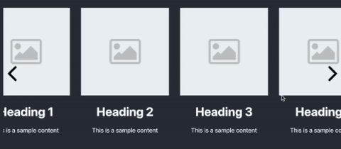

## Available Scripts

Horizontal scroll view. Ability to scroll on drag.
````
npm i horizontal-scroll-view

OR

yarn add horizontal-scroll-view
````

### Demo



### How to use?

````
import Horizontal from "horizontal-scroll-view";

<Horizontal
            data={data} // Array of object
            Component={Item} // Component that is going to be rendered and recieve object from above array
            wrapperClass="customClass"
            scrollLength={100} // How much the scroll should jump on left or right contorl click
            showControls={true}

        />

````

#### Item Component

````

const Item: React.FC<InnerProps> = (props) => {
    let { item } = props;
    return <div className="contentWrapper">
      
      <h1>{item.title}</h1>
      <p>{item.content}</p>
    </div>
  };


````

#### Props

| Props |  Types | Description | Required | Default |
|-------|--------|-------------|----------|---------|
|  data | array  | Array of object on which the loop will be applied and individual object will be returned to Component  |  true | false  |
|  Component | Component | The component on which the loop will be applied and and single object will be passed as props to this component | true | false |
|  wrapperClass | string  | class will be applied on the wrapping div  | false  | - |
| scrollLength  | number  | How much the scroll should jump on left or right contorl click |  false | 40 |
| showControls | bool  | Show/hide left right arrows  | false | false |

